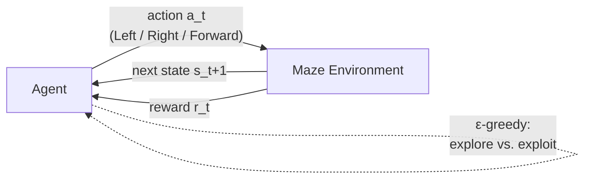
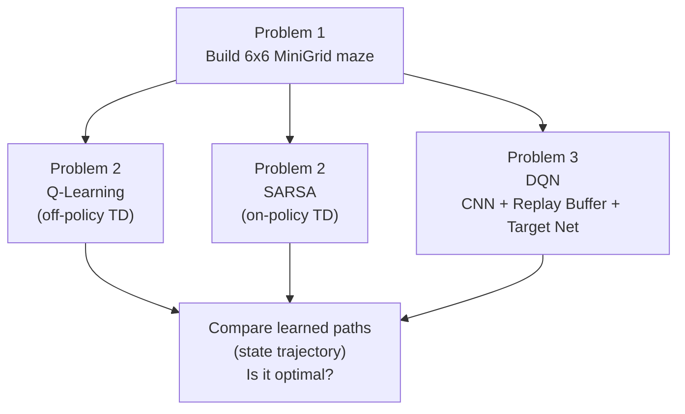
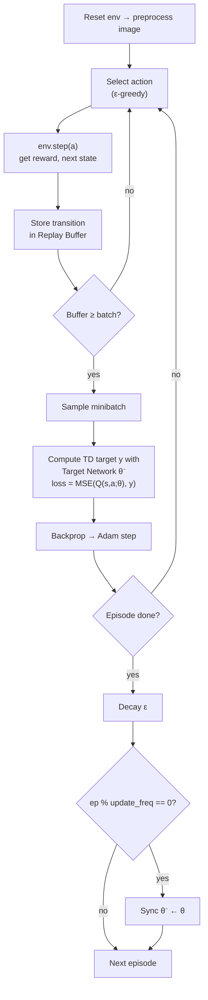

# Project 3 — Reinforcement Learning in a Grid Maze

**Course:** Introduction to Optimization (최적화개론), Hanyang University
**Instructor:** Prof. Jun Moon
**Team:** 3조 — 최윤석, 김영민

> Train an agent to find the **shortest path** through a 6×6 [MiniGrid](https://minigrid.farama.org/) maze
> and — the core of this project — **analyze how Q-Learning, SARSA, and DQN differ** in formulation and
> in the policies they learn.

---

## 1. Objective

Design a discrete maze environment and solve it with three RL algorithms, then compare their update
rules, the assumptions behind them, and the paths they converge to.

| # | Problem | Method | Idea |
|---|---------|--------|------|
| **1** | Build the maze | MiniGrid | Custom 6×6 grid: start, goal, walls, 3 actions |
| **2** | Solve the maze | Q-Learning & SARSA | Tabular TD control over `(x, y, direction)` states |
| **3** | Solve the maze | DQN | CNN on image observations + Replay Buffer + Target Network |

---

## 2. The Maze Environment (Problem 1)

A custom `MiniGridEnv` (6×6). The agent starts at the top-left and must reach the green goal in as few
steps as possible while avoiding gray walls.

| Property | Value |
|----------|-------|
| Grid size | 6 × 6 (outer border is wall) |
| Start state | `(1, 1)`, facing right |
| Goal state | bottom-right interior cell (green) |
| Walls | gray cells, e.g. `(1,3) (1,4) (2,3) (3,3) (4,1) (4,5) (5,5)` |
| Action space | `Discrete(3)` → **Left**, **Right**, **Forward** |
| Max steps | `4 × size × size = 144` per episode |
| Objective | shortest path from start to goal |

State is represented as the tuple `(x, y, direction)` for the tabular methods, and as a preprocessed
partial RGB image for DQN.

---

## 3. Common Ground: the RL Formulation

All three methods model the maze as a **Markov Decision Process** and share the same agent–environment
loop; only the way the action-value function $Q$ is *represented* and *updated* differs.



**Return** (discounted sum of future rewards) and the **action-value function** we want to estimate:

$$
G_t = \sum_{k=0}^{\infty} \gamma^{k}\, r_{t+k+1}, \qquad
Q^{\pi}(s,a) = \mathbb{E}_{\pi}\!\left[\, G_t \mid s_t = s,\ a_t = a \,\right]
$$

The optimal values satisfy the **Bellman optimality equation**:

$$
Q^{*}(s,a) = \mathbb{E}\!\left[\, r_{t+1} + \gamma \max_{a'} Q^{*}(s_{t+1}, a') \;\middle|\; s_t=s,\ a_t=a \,\right]
$$

**Behavior policy — ε-greedy** (shared by all three, with ε decaying each episode):

$$
a_t =
\begin{cases}
\arg\max_{a} Q(s_t, a) & \text{with probability } 1-\epsilon \\[4pt]
\text{a uniformly random action} & \text{with probability } \epsilon
\end{cases}
$$

### Project pipeline



---

## 4. Core: Q-Learning vs SARSA vs DQN

The three algorithms differ in **one place — the TD target** — plus how $Q$ is stored. Everything else
(the ε-greedy behavior, γ, the reward) is held equal so the comparison is clean.

### 4.1 Q-Learning — off-policy tabular TD control

Bootstraps from the **greedy** next action ($\max_a$), regardless of what the agent actually does next.
It therefore estimates $Q^{*}$ independently of the exploratory behavior policy → **off-policy**.

$$
Q(s_t, a_t) \leftarrow Q(s_t, a_t) + \alpha \Big[\, r_{t+1} + \gamma \max_{a} Q(s_{t+1}, a) - Q(s_t, a_t) \,\Big]
$$

### 4.2 SARSA — on-policy tabular TD control

Bootstraps from the action $a_{t+1}$ **actually chosen** by the ε-greedy policy at $s_{t+1}$. Its values
reflect the exploration it is doing → **on-policy** (the name comes from the tuple
$(s_t, a_t, r_{t+1}, s_{t+1}, a_{t+1})$).

$$
Q(s_t, a_t) \leftarrow Q(s_t, a_t) + \alpha \Big[\, r_{t+1} + \gamma\, Q(s_{t+1}, a_{t+1}) - Q(s_t, a_t) \,\Big],
\qquad a_{t+1} \sim \pi_{\epsilon}(\cdot \mid s_{t+1})
$$

> **The single difference:** Q-Learning uses $\max_a Q(s_{t+1}, a)$; SARSA uses $Q(s_{t+1}, a_{t+1})$ for
> the action it will really take. When ε → 0 the two targets coincide.

### 4.3 DQN — off-policy with function approximation

DQN keeps Q-Learning's greedy (off-policy) target but replaces the table with a **neural network**
$Q(s, a; \theta)$ (a CNN reading the image). Two tricks make training with a nonlinear approximator
stable: a **Replay Buffer** $\mathcal{D}$ (decorrelates samples) and a **Target Network** $\theta^{-}$
(a periodically-frozen copy that keeps the bootstrap target from moving every step).

TD target (computed with the frozen target network):

$$
y_t = r_{t+1} + \gamma \max_{a'} Q(s_{t+1}, a';\, \theta^{-})
$$

Loss minimized over minibatches sampled from the replay buffer, and the gradient step:

$$
L(\theta) = \mathbb{E}_{(s,a,r,s') \sim \mathcal{D}}\Big[\big(\, y - Q(s, a;\, \theta)\,\big)^{2}\Big],
\qquad
\theta \leftarrow \theta - \eta\, \nabla_{\theta} L(\theta)
$$

The target network is synced to the online network, $\theta^{-} \leftarrow \theta$, every few episodes.

### 4.4 Side-by-side comparison

| Aspect | Q-Learning | SARSA | DQN |
|--------|-----------|-------|-----|
| Policy class | **Off-policy** | **On-policy** | **Off-policy** |
| TD target | $r + \gamma \max_a Q(s',a)$ | $r + \gamma\, Q(s',a')$ | $r + \gamma \max_{a'} Q(s',a';\theta^{-})$ |
| Next action in target | greedy ($\max$) | the one actually sampled | greedy ($\max$) |
| $Q$ representation | table $(x,y,\text{dir},a)$ | table $(x,y,\text{dir},a)$ | CNN $Q(s,a;\theta)$ |
| State input | discrete tuple | discrete tuple | preprocessed image |
| Stability mechanism | — | — | replay buffer + target network |
| Generalization | none (exact per state) | none (exact per state) | yes (shared weights) |
| Learned policy tendency | optimal, can hug hazards | more **conservative** under exploration | optimal (approximate) |

### 4.5 What the differences mean here

- **Q-Learning vs SARSA.** The only change is the bootstrap action. Q-Learning learns the optimal
  greedy policy directly; SARSA learns the value of the policy *including its exploration*, so it prefers
  paths that stay safe while ε is still large. In a maze whose only penalty is a small per-step cost
  (no "cliff"), both converge to essentially the **same shortest path**, but SARSA's intermediate values
  are more conservative and its ε is decayed faster (0.995 vs 0.999) to settle sooner.
- **Tabular vs DQN.** Q-Learning and SARSA store one number per `(state, action)` — exact but with no
  generalization and no scaling to large/continuous inputs. DQN reads the raw image and *approximates*
  $Q$, so it can generalize across similar states, at the cost of instability that the replay buffer and
  target network are there to tame. Conceptually **DQN = Q-Learning + function approximation**.

---

## 5. DQN Implementation Details (Problem 3)

**Key components**

- **Replay Buffer** — stores `(state, action, reward, next_state, done)` transitions and samples random
  minibatches, breaking correlation between consecutive experiences.
- **Target Network** — a periodically-synced copy $\theta^{-}$ of the online network used to compute the
  TD target $y_t$, keeping it stable.
- **Image preprocessing** — partial RGB observation → grayscale → normalized tensor.
- **Reward shaping** — `-0.01` per step (discourages wandering), `+1.0` on reaching the goal.

**DQN training loop**



**Hyperparameters**

| | Q-Learning | SARSA | DQN |
|---|-----------|-------|-----|
| Discount $\gamma$ | 0.99 | 0.99 | 0.99 |
| Learning rate $\alpha$ / $\eta$ | 0.1 | 0.1 | 1e-4 (Adam) |
| ε schedule | 1.0, decay 0.999 | 1.0, decay 0.995 | 1.0 → 0.01, decay 0.999 |
| Episodes | 5,000 | 5,000 | 1,000 |
| Function approx. | — | — | Conv2d(→16→32→32) + FC(256→3) |
| Replay buffer | — | — | 10,000 |
| Minibatch | — | — | 32 |
| Target update | — | — | every 20 episodes |

---

## 6. Files

| File | Description |
|------|-------------|
| `problem1(maze_environment)_3조_(최윤석,_김영민).py` | Problem 1 — custom 6×6 MiniGrid maze + rendering |
| `problem2(q_learning,_sarsa)_3조(최윤석,김영민).py` | Problem 2 — Q-Learning & SARSA training and rollout |
| `problem3(dqn)_3조(최윤석,_김영민).py` | Problem 3 — DQN (CNN, replay buffer, target network) |
| `Qlearing_maze.mp4` | Learned Q-Learning path video |
| `SARSA_maze.mp4` | Learned SARSA path video |
| `DQN_maze.mp4` | Learned DQN path video |
| `Project_3_2025_Opt_Undergrad.pdf` | Original assignment slides |
| `[최적화개론 Project3] 발표자료_3조_(최윤석, 김영민).pdf` | Team presentation slides |
| `[최적화개론 Project3] 솔루션_3조_(최윤석, 김영민).pdf` | Full written solution |

> **Note:** the scripts were written in Google Colab. Cells that mount Google Drive
> (`from google.colab import drive`) are Colab-specific and can be removed when running locally.

---

## 7. Running the Code

```bash
pip install numpy matplotlib tqdm imageio
pip install gymnasium==1.0.0 minigrid
pip install torch torchvision   # Problem 3 (DQN) only
```

Each script is standalone — run it top to bottom (or open in Colab) to train the agent, plot the
reward curve, and render the learned path.

---

## 8. Results & Discussion

- **Learning curves** — total reward per episode is plotted for each method; the curve rises and
  stabilizes as ε decays and the policy shifts from **exploration → exploitation**.
- **Optimality** — the greedy trajectory after training is inspected to confirm the agent takes the
  shortest collision-free path from start to goal.
- **Q-Learning vs SARSA** — identical except for the TD target; off-policy vs on-policy learning yields
  the same optimal path in this maze but different intermediate value estimates (see §4.5).
- **DQN** — matches the tabular optimum while learning directly from image observations, showing that
  function approximation recovers the same policy at the cost of more compute and tuning.

---

> The `PJ1_Problem1_(4/5/6).py` files belong to **Project 1** — see [Project 1](Project1.md).
