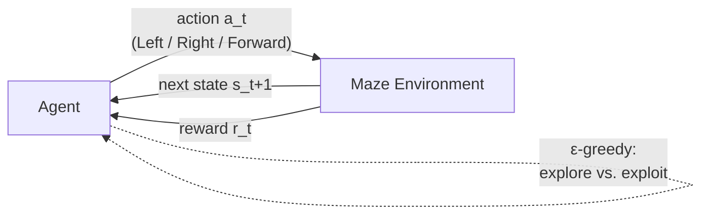
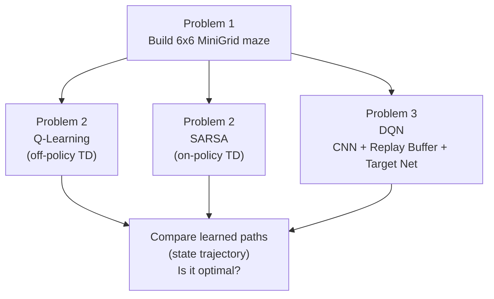
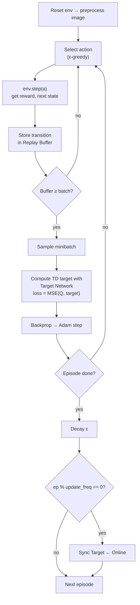

# Project 3 — Reinforcement Learning in a Grid Maze

**Course:** Introduction to Optimization (최적화개론), Hanyang University
**Instructor:** Prof. Jun Moon
**Team:** 3조 — 최윤석, 김영민

> Train an agent to find the **shortest path** through a 6×6 [MiniGrid](https://minigrid.farama.org/) maze
> using both **tabular** reinforcement learning (Q-Learning, SARSA) and **deep** reinforcement learning (DQN).

---

## 1. Objective

Design a discrete maze environment and solve it with three different RL approaches, then compare the
learned paths and discuss whether each is optimal.

| # | Problem | Method | Idea |
|---|---------|--------|------|
| **1** | Build the maze | MiniGrid | Custom 6×6 grid: start, goal, walls, 3 actions |
| **2** | Solve the maze | Q-Learning & SARSA | Tabular TD control over `(x, y, direction)` states |
| **3** | Solve the maze | DQN | CNN on image observations + Replay Buffer + Target Network |

---

## 2. The Maze Environment (Problem 1)

A custom `MiniGridEnv` (6×6). The agent starts at the top-left and must reach the green goal in as few
steps as possible while avoiding gray walls.

| Property | Value |
|----------|-------|
| Grid size | 6 × 6 (outer border is wall) |
| Start state | `(1, 1)`, facing right |
| Goal state | bottom-right interior cell (green) |
| Walls | gray cells, e.g. `(1,3) (1,4) (2,3) (3,3) (4,1) (4,5) (5,5)` |
| Action space | `Discrete(3)` → **Left**, **Right**, **Forward** |
| Max steps | `4 × size × size = 144` per episode |
| Objective | shortest path from start to goal |

State is represented as the tuple `(x, y, direction)` for the tabular methods, and as a preprocessed
partial RGB image for DQN.

---

## 3. How the Agent Learns

All three methods share the same agent–environment interaction loop; only the way `Q` is stored and
updated differs.



### Project pipeline



---

## 4. Tabular Methods (Problem 2)

Both algorithms keep a Q-table of shape `(width, height, 4 directions, 3 actions)` and select actions
with an **ε-greedy** policy whose ε decays each episode.

| | Q-Learning | SARSA |
|---|------------|-------|
| Type | Off-policy | On-policy |
| TD target | `r + γ · max_a Q(s', a)` | `r + γ · Q(s', a')` |
| Update | uses the *greedy* next action | uses the *actually chosen* next action |
| Hyperparameters | γ = 0.99, lr = 0.1, ε-decay = 0.999, 5000 episodes | γ = 0.99, lr = 0.1, ε-decay = 0.995, 5000 episodes |

After training, the greedy policy is rolled out and the resulting **state trajectory** `(x, y, dir)` is
printed and rendered to video to check optimality.

---

## 5. Deep Q-Network (Problem 3)

DQN replaces the Q-table with a **CNN** that maps an image observation to Q-values for the 3 actions.

**Key components**

- **Replay Buffer** — stores `(state, action, reward, next_state, done)` transitions and samples random
  minibatches, breaking correlation between consecutive experiences.
- **Target Network** — a periodically-synced copy of the online network used to compute stable TD targets.
- **Image preprocessing** — partial RGB observation → grayscale → normalized tensor.
- **Reward shaping** — `-0.01` per step (discourages wandering), `+1.0` on reaching the goal.

**DQN training loop**



**Hyperparameters**

| Parameter | Value |
|-----------|-------|
| Network | Conv2d(→16→32→32) + FC(256 → 3) |
| Optimizer | Adam, lr = 1e-4 |
| Discount γ | 0.99 |
| Replay buffer size | 10,000 |
| Minibatch size | 32 |
| Episodes | 1,000 |
| ε | 1.0 → 0.01 (decay 0.999) |
| Target update period | every 20 episodes |

---

## 6. Files

| File | Description |
|------|-------------|
| `problem1(maze_environment)_3조_(최윤석,_김영민).py` | Problem 1 — custom 6×6 MiniGrid maze + rendering |
| `problem2(q_learning,_sarsa)_3조(최윤석,김영민).py` | Problem 2 — Q-Learning & SARSA training and rollout |
| `problem3(dqn)_3조(최윤석,_김영민).py` | Problem 3 — DQN (CNN, replay buffer, target network) |
| `Qlearing_maze.mp4` | Learned Q-Learning path video |
| `SARSA_maze.mp4` | Learned SARSA path video |
| `DQN_maze.mp4` | Learned DQN path video |
| `Project_3_2025_Opt_Undergrad.pdf` | Original assignment slides |
| `[최적화개론 Project3] 발표자료_3조_(최윤석, 김영민).pdf` | Team presentation slides |
| `[최적화개론 Project3] 솔루션_3조_(최윤석, 김영민).pdf` | Full written solution |

> **Note:** the scripts were written in Google Colab. Cells that mount Google Drive
> (`from google.colab import drive`) are Colab-specific and can be removed when running locally.

---

## 7. Running the Code

```bash
pip install numpy matplotlib tqdm imageio
pip install gymnasium==1.0.0 minigrid
pip install torch torchvision   # Problem 3 (DQN) only
```

Each script is standalone — run it top to bottom (or open in Colab) to train the agent, plot the
reward curve, and render the learned path.

---

## 8. Results & Discussion

- **Learning curves** — total reward per episode is plotted for each method; the curve rises and
  stabilizes as ε decays and the policy shifts from **exploration → exploitation**.
- **Optimality** — the greedy trajectory after training is inspected to confirm the agent takes the
  shortest collision-free path from start to goal.
- **Q-Learning vs. SARSA** — off-policy vs. on-policy updates lead to slightly different learned paths,
  discussed in the solution PDF.
- **DQN** — learns directly from image observations without a hand-built state table, at the cost of
  more compute and hyperparameter tuning.

---

> The `PJ1_Problem1_(4/5/6).py` files belong to **Project 1** — see [Project 1](Project1.md).
